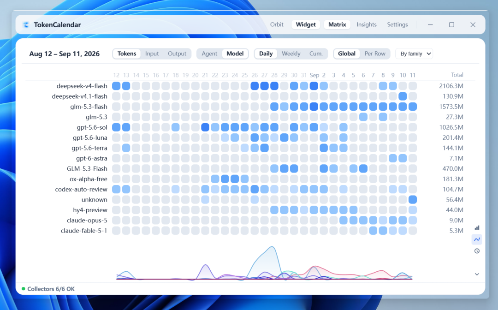
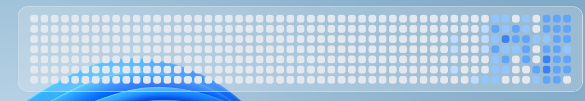
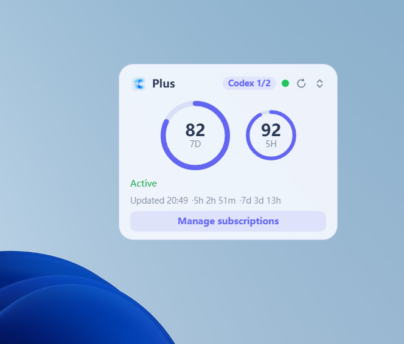

# TokenCalendar

> 本地优先的桌面挂件：把本机各类 AI Agent 的 token 用量统一成「Agent/模型 × 日期」的年度热力图，
> 贴桌面常驻、可钻取。Tauri 2 + Rust + React/TS 实现。

## 功能

- **用量矩阵**：Agent/模型 × 日期的年度与月度热力图，支持日/周/累计粒度与双向钻取。
- **本机采集**：只读扫描六类 Agent 的本地日志/数据库（ZCode、WorkBuddy、Claude Code、
  Codex、CodeBuddy、DSH），聚合结果只保存在本机。
- **数据洞察**：用量趋势、模型分布、异常日与积分月报（手写 SVG，不引图表库）；CodeBuddy / WorkBuddy 的模型与积分
  直接读本机数据，无需导入官网账单。
- **项目与任务分析**：按工作目录聚合的项目维度、等待 / 人工时间成本、按会话列出的任务视图
  （轮数 / 步数 / 工具调用 / 耗时 / 错误与中止、逐轮条形）与项目管理；只存元数据，不存对话正文。
- **桌面形态**：主窗口 + 贴桌面挂件 + 订阅额度悬浮球；主题（取色/透明度/圆角/毛玻璃）
  与窗口几何本地持久化。

## 界面

- **主界面**：Agent/模型 × 日期的用量矩阵，Token / 积分双口径、日 / 周 / 累计三档粒度，底部趋势曲线与矩阵行联动；

  

- **桌面挂件**：年度热力图贴片，贴桌面常驻、可钻取；

  

- **订阅额度悬浮球**：展开为周额度环 + 中央 5 小时表盘（额度读数、重置时刻、套餐状态，右侧按钮列），
  收起为贴边竖条（周额度水位）；

  
  

## 使用：Tasks 与 Projects

- **Tasks**（标题栏 Matrix / Insights / Tasks）：每行一个会话，列出轮数、步数（模型调用）、工具调用、
  Wait（等待模型与工具的时间）、错误、子代理与 token；点表头排序，点一行展开逐轮条形（红描边 = 被中断的轮）。
  顶部 Idle gaps 卡片是轮间空档分布，超过离开阈值（默认 30 分钟，可改）的空档不计入 Human 时间。
  范围条支持 `7d / 30d / 90d / All / Custom`；选定某个项目时范围自动切到该项目的首末活动日。
  标签可在开始时间与会话标题之间切换（标题只在本机显示）。
- **项目维度**：Matrix 与 Insights 的维度切到 Project，按工作目录看 token；Project 维下可选
  Wait / Human 两项时间指标（并列展示，不相加）。CodeBuddy 按会话记录的工作目录归属项目，临时对话（playground）归入 Scratch。
- **Projects**（设置 → Projects，或项目列表末尾的 Manage projects…）：重命名、隐藏、把多个目录合并为一个项目、
  打开文件夹；会话很少的临时目录默认折叠进 Scratch（阈值可调、可关）。隐藏与合并只影响项目维视图，
  Agent / Model 维的数字不变；这些设置独立保存，清库重扫不会丢失。

> **升级提示**：从 0.6.2 起，统计口径变更不再清库重扫——首次启动先把旧库备份到数据目录 `backups/`，再就地升级已有记录，
> 列表不会清空。0.5.6〜0.5.9 升级到本版会经历最后一次清库（结构差异），首轮扫描完成前列表为空属正常；
> 项目管理设置保留，需要保留旧数字时请先在「设置 → Data」备份。

## 快速开始

```bash
pnpm install                  # 前端依赖（pnpm）
pnpm dev:full                 # 开发模式（= tauri dev）
pnpm tauri build --no-bundle  # 生产构建 → src-tauri/target/release/tokencalendar.exe
pnpm tauri build              # NSIS 安装包 → src-tauri/target/release/bundle/nsis/
```

透明/毛玻璃等窗口效果以生产构建为准；dev 模式下打开 DevTools 时 WebView2 会强制不透明。
NSIS 出包会为更新包签名（`src-tauri/tauri.conf.json` 的 `plugins.updater`），需要本地
配置签名私钥；只验证构建可直接用上方 `--no-bundle` 那条。

## 版本

- **0.6.3** —— 修复 0.6.2 项目列表出现以文件夹编码名显示的重复项目（如 `e--Projects-Foo`，升级时就地改回真实路径）；
  时间轴点击等待中的项目即把对应 Agent 窗口带到前面，Agent 已关闭时灰色保留打开目录入口；修复悬浮球偶发以错误形态启动。
- **0.6.2** —— 修正会话项目归属（Claude Code 对话中 `cd` 进子目录、ZCode 子代理在子目录运行时被拆成子目录伪项目或
  归入 Scratch），改为按各 Agent 自己的会话记录归属；**升级不再清库重扫**：先备份旧库到 `backups/`，再就地升级已有记录。
- **0.6.1** —— 修复 Windows「文本大小」大于 100% 时悬浮球只剩左上角一道弧（悬浮球随文本大小同步放大）；
  修复 Claude Code 续聊 / fork 副本重复计数（轮数与 token 高估约三分之一），**升级会一次性清库重扫**；
  新增第四窗口「时间轴 Timeline」只读预览（项目 × 日看板，托盘或设置 → General 打开）。
- **0.5.9** —— 界面打磨：Matrix 的颜色刻度与排序控件从工具栏移到热力图右缘的图标开关
  （默认全局刻度 / 按 tokens 排序，Model 标签页额外提供模型家族分组），工具栏更窄；
  修复 Insights 图表纵轴顶端刻度被裁切。
- **0.5.8** —— CodeBuddy 对话按真实工作目录拆分项目（不再全部归入 Scratch），任务列表显示会话标题；
  CodeBuddy 模型与 CodeBuddy / WorkBuddy 积分改读本机数据，**移除官网账单导入**；设置 → General 新增采集频率
  （30 秒 / 1 / 2 / 3 / 5 分钟）。**升级会一次性清库重扫**，已导入的官网账单不再使用。
- **0.5.7** —— 项目与任务分析：Matrix / Insights 项目维度与 Wait / Human 时间成本、Tasks 视图（逐轮条形、
  中止与错误分列、离开阈值与空档分布）、范围 All / Custom 与项目生命周期、Projects 管理（重命名 / 隐藏 /
  合并 / Scratch）；修正 Claude Code token 重复计数（约高估 2.7 倍）、Codex 子代理轮误计、ZCode 子会话计轮、
  WorkBuddy 纯文本回复漏计，ZCode 补入小时粒度。**升级会一次性清库重扫**，部分历史数字会变化。
- **0.5.6** —— 修复应用内更新（0.5.2 起「下载完成后不启动安装器」的根因 = 更新签名公钥与私钥不配套）；
  该区间版本需手动下载本版一次，之后即可正常一键更新。
- **0.5.5** —— 订阅监控健壮性修复（待机深档时刷新 / 绑定 / 改间隔立即生效，解绑即停止加速检测请求，
  退出回落不再跳变，开关切换不重复抓取），并补全主界面 / 洞察 / 明细 / 设置页的悬停提示。
- **0.5.4** —— 悬浮球鼠标交互修复（透明画布不再抢占下层窗口的点击与悬停，右键只在球体上响应），
  消除划过容器的原生边框闪烁与跨屏贴边过程中的窗口抖动。
- **0.5.3** —— 悬浮球多显示器修复（跨屏贴边不再嵌入接缝、形态转换不再闪烁、
  收起态竖条吸附更一致），启动时恢复上次形态与位置。
- **0.5.2** —— 悬浮球交互与视觉打磨（展开圆盘 / 贴边竖条 / 悬停浮层 / 刷新动画 /
  多显示器几何重做）、Claude 授权检测修复、新增应用内更新（签名校验 + 自动更新开关）。
- **0.3.7** —— 首个公开版本：主界面 / 桌面挂件 / 订阅额度悬浮球三窗口，
  六源本机采集（ZCode、WorkBuddy、Claude Code、Codex、CodeBuddy、DSH），
  数据洞察（趋势 / 模型分布 / 异常日 / 积分月报），主题化与贴片化工作区吸附。

## 许可

MIT，见 [LICENSE](LICENSE)。第三方组件、署名与许可义务见
[THIRD-PARTY-NOTICES.md](THIRD-PARTY-NOTICES.md)。
